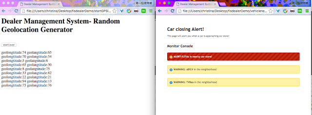

#Fuse Integration Service - Auto Dealership Management System

 
1. Install OpenShift or have an OpenShift platform 
2. Install OpenShift client
   Instruction to install please go to my blog at:
   http://wei-meilin.blogspot.tw/2016/01/fuse-integration-service-getting-your_19.html

3. Create a project 'fisdemo' in Openshift	

4. Install A-MQ and Fuse template on OpenShift 

5. Follow the lab instruction in the workshop

Here is what this lab is all about : 	
	A. Inventory service, are expose as Restful endpoint, to test it, simply access via a browser with following url
	
	 - Provide inventory status of the vehicle
		 - http://inventoryervice-fisdemo.rhel-cdk.10.1.2.2.xip.io/AutoDMS/getVehicle/vno03
	 - Provide inventory status of all vehicle with the price range
		 - http://inventoryervice-fisdemo.cdk.10.1.2.2.xip.io/AutoDMS/availableVehicle/pricerange/20000/40000

	
	B. Sales service, there is two way to test,
	
	 - Access the restful endpoint with browser,
		 - http://salesreportfile-fisdemo.rhel-cdk.10.1.2.2.xip.io/AutoDMS/salesTracking
	 - Test with web application (installation instruction please visit:
		 - https://github.com/RedHat-Middleware-Workshops/jboss-fis-autodealerweb)
		 - http://mydemo-phpdemo.rhel-cdk.10.1.2.2.xip.io/sales/sales.html

	  
	C. GPS service -Test with web application (installation instruction please visit:
	https://github.com/RedHat-Middleware-Workshops/jboss-fis-autodealerweb)
	
	 - We will open two pages, one that will feed GPS location data to our
   service,
		 - http://mydemo-phpdemo.rhel-cdk.10.1.2.2.xip.io/gps/startGPSlocation.html
	 - Then we can start receiving the alert from console,
		 - http://mydemo-phpdemo.rhel-cdk.10.1.2.2.xip.io/gps/vehiclenearbyconsole.html

	 

		

